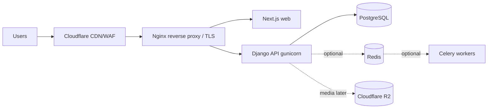

# Deployment Guide

> Target: DigitalOcean (Docker) initially; architecture scales toward managed
> Postgres + multiple API containers + CDN.

## Topology

## Environments

| Env | DB | Notes |
|-----|----|-------|
| Local | local Postgres (or SQLite for tests) | `runserver` + `npm run dev`, no Docker required |
| Staging | managed Postgres | mirror of prod; run migrations + imports here first |
| Production | managed Postgres + backups | Docker images behind Nginx on DigitalOcean |

## Backend (Django) production checklist

- `DJANGO_DEBUG=False`, strong `DJANGO_SECRET_KEY`, correct `DJANGO_ALLOWED_HOSTS`.
- `DATABASE_URL` → managed Postgres; `FRONTEND_URL` → public site (certificate QR).
- `CORS_ALLOWED_ORIGINS` → the web domain only.
- `python manage.py migrate` then `python manage.py collectstatic`.
- Serve via `gunicorn config.wsgi` (in `requirements-optional.txt`); static via
  Nginx/WhiteNoise; media via Cloudflare R2 (set `MEDIA_ROOT`/storage backend).
- Run `seed_content` / `seed_courses` once on first deploy if desired.

## Frontend (Next.js)

- `npm run build` → `npm start` (or container).
- `NEXT_PUBLIC_API_URL` → public API URL.

## Docker

`docker compose up --build` runs postgres + redis + api + web (the `api`
container overrides DB host to the `postgres` service). For production, build
images per app from `apps/*/Dockerfile` and place Nginx in front.

## Database migrations & content imports

1. Deploy code, run `migrate`.
2. (Optional) `seed_content` / `seed_courses` for baseline data.
3. Content migration: follow [MIGRATION_GUIDE.md](MIGRATION_GUIDE.md) — dry-run
   imports on staging, then apply.

## Scaling strategy

- **API**: stateless containers behind a load balancer; scale horizontally.
- **DB**: managed Postgres with connection pooling; add read replicas as reads grow.
- **Cache/async**: enable Redis + Celery (already wired, optional) for caching
  and background jobs (emails, certificate generation, future Zoom sync).
- **Media/CDN**: Cloudflare R2 for files + Cloudflare CDN/WAF in front.
- **Observability**: error tracking (Sentry) + uptime monitoring before scale.

## Backups & safety

- Automated daily Postgres backups + point-in-time recovery on the managed DB.
- Never commit `.env`; rotate `DJANGO_SECRET_KEY` and DB credentials per env.
