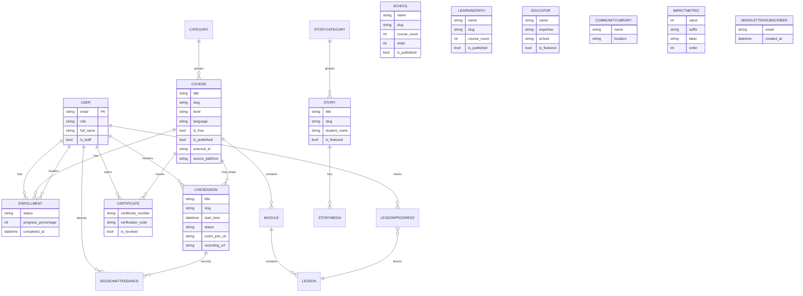

# Entity Relationship Diagram

> Core data model for Digital Nalanda LMS. Apps: `users`, `courses`,
> `enrollments`, `progress`, `certificates`, `live_sessions`, `content`.

## Notes on relationships

- **User** is a custom model (`AUTH_USER_MODEL = users.User`); email is the login
  identifier and unique. `role` ∈ {student, mentor, content_manager, admin}.
- **Course → Module → Lesson** is the content hierarchy. `Course`, `Module`,
  `Lesson` carry migration-readiness fields (`external_id`, `source_platform`,
  `original_url`, `migration_notes`, `imported_at`).
- **Enrollment** is unique per (student, course); **LessonProgress** unique per
  (student, lesson). `recalc_progress` recomputes `progress_percentage`/status
  and auto-issues a **Certificate** on completion.
- **LiveSession**/**Event** are loosely related to schools/courses by name today;
  **SessionAttendance** is unique per (student, session).
- **content** app (homepage data): School, LearningPath, Educator,
  CommunityLibrary, ImpactMetric, Story (+ StoryCategory, StoryMedia),
  NewsletterSubscriber — all admin-managed and exposed via public read APIs.
