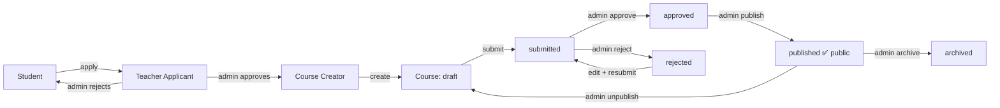

# Permissions Matrix

> Roles and what each can do. Roles live on `users.User.role`
> (`student`, `mentor`, `content_manager`, `admin`) plus Django's `is_staff` /
> `is_superuser`. "Super Admin" = `is_superuser`.

## Roles

| Role | Description |
|------|-------------|
| **Super Admin** | `is_superuser`. Full Django admin + all APIs. |
| **Admin** | `role=admin` or `is_staff`. Manage content, live sessions, dashboard. |
| **Content Manager** | `role=content_manager`. Manage homepage content + stats dashboard. |
| **Teacher Applicant** | `role=teacher_applicant`. Applied to teach; awaiting review. No creator access. |
| **Course Creator** | `role=course_creator`. Create/edit own draft courses, submit for review; cannot publish. |
| **Mentor** | `role=mentor`. View own live sessions + attendance. |
| **Student** | `role=student` (default). Learn, enroll, earn certificates. |
| **Anonymous** | Not logged in. Public read-only content. |

## Capability matrix

| Capability | Anon | Student | Mentor | Content Mgr | Admin | Super Admin |
|------------|:----:|:------:|:------:|:-----------:|:-----:|:-----------:|
| Browse courses / schools / stories / events | ✅ | ✅ | ✅ | ✅ | ✅ | ✅ |
| Verify a certificate (public) | ✅ | ✅ | ✅ | ✅ | ✅ | ✅ |
| Register / login | ✅ | — | — | — | — | — |
| Enroll, track progress | — | ✅ | ✅ | ✅ | ✅ | ✅ |
| Earn / download own certificate | — | ✅ | ✅ | ✅ | ✅ | ✅ |
| Join live class (attendance) | — | ✅ | ✅ | ✅ | ✅ | ✅ |
| View own mentored sessions + attendance | — | — | ✅ | — | ✅ | ✅ |
| Admin stats dashboard (`/admin`, `/api/admin/stats/`) | — | — | — | ✅ | ✅ | ✅ |
| Export newsletter CSV | — | — | — | ✅ | ✅ | ✅ |
| Create/edit live sessions & events (API) | — | — | — | ✅* | ✅ | ✅ |
| Manage homepage content (Django admin) | — | — | — | ✅ | ✅ | ✅ |
| Run CSV import commands | — | — | — | — | ✅ | ✅ |
| Full Django admin | — | — | — | partial | ✅ | ✅ |

\* `IsAdminRole` allows `admin` + staff; content managers manage via Django admin.

## Enforcement points

- **DRF permissions**: `IsAuthenticated`, `IsAuthenticatedOrReadOnly` (default),
  custom `IsAdminRole` / `IsMentorOrAdmin` (live_sessions), `IsStaffOrAdmin`
  (adminpanel).
- **JWT**: access token in `Authorization: Bearer`; role travels on the user.
- **Frontend**: `/admin` and the profile "Admin Dashboard" link are gated on
  `is_staff || role ∈ {admin, content_manager}`; backend re-checks regardless.
- **Public reads**: homepage/content/courses/stories/live endpoints are
  `AllowAny`; write/management endpoints require the roles above.

## Teacher onboarding & course approval flow

**Rules enforced (backend):** students can't call creator APIs; applicants can't
create courses until approved; creators edit only their own draft/rejected
courses and cannot publish; only admin/content-manager/super-admin approve,
publish, unpublish, archive. Public APIs show only `status=published`. Every
transition is written to the **AuditLog**.

## Full feature matrix

Legend: ✅ allowed · ➖ own only · ❌ no

| Feature | Student | Teacher Applicant | Course Creator | Mentor | Event Mgr | Content Mgr | Admin | Super Admin |
|---------|:------:|:----:|:----:|:----:|:----:|:----:|:----:|:----:|
| View courses | ✅ | ✅ | ✅ | ✅ | ✅ | ✅ | ✅ | ✅ |
| Enroll / learn | ✅ | ✅ | ✅ | ✅ | ✅ | ✅ | ✅ | ✅ |
| Apply to teach | ✅ | ➖ | — | — | — | — | — | — |
| Create course (draft) | ❌ | ❌ | ✅ | ❌ | ❌ | ✅ | ✅ | ✅ |
| Edit own course | ❌ | ❌ | ➖ | ❌ | ❌ | ✅ | ✅ | ✅ |
| Edit others' course | ❌ | ❌ | ❌ | ❌ | ❌ | ✅ | ✅ | ✅ |
| Submit course for review | ❌ | ❌ | ➖ | ❌ | ❌ | ✅ | ✅ | ✅ |
| Publish course | ❌ | ❌ | ❌ | ❌ | ❌ | ✅ | ✅ | ✅ |
| View versions / diff own course | ❌ | ❌ | ➖ | ❌ | ❌ | ✅ | ✅ | ✅ |
| Restore/rollback own course | ❌ | ❌ | ➖ | ❌ | ❌ | ✅ | ✅ | ✅ |
| Delete/archive course | ❌ | ❌ | ❌ | ❌ | ❌ | ✅ | ✅ | ✅ |
| Approve teacher | ❌ | ❌ | ❌ | ❌ | ❌ | ❌ | ✅ | ✅ |
| Manage users / roles | ❌ | ❌ | ❌ | ❌ | ❌ | ❌ | ✅ | ✅ |
| Manage certificates | ❌ | ❌ | ❌ | ❌ | ❌ | ❌ | ✅ | ✅ |
| Manage events | ❌ | ❌ | ❌ | ❌ | ✅ | ✅ | ✅ | ✅ |
| Manage live classes | ❌ | ❌ | ❌ | ➖ | ❌ | ✅ | ✅ | ✅ |
| Manage homepage content | ❌ | ❌ | ❌ | ❌ | ❌ | ✅ | ✅ | ✅ |
| View reports / dashboard | ❌ | ❌ | ❌ | ❌ | ✅ | ✅ | ✅ | ✅ |
| Export data (CSV) | ❌ | ❌ | ❌ | ❌ | ➖ | ✅ | ✅ | ✅ |
| Remove super admin | ❌ | ❌ | ❌ | ❌ | ❌ | ❌ | ❌ | ✅ |

> "➖ own only" for export/live = scoped to the manager's own area. Roles
> `library_coordinator` and `volunteer` are defined for future modules
> (community libraries, volunteering) and currently have student-level access
> plus their own dashboard.
