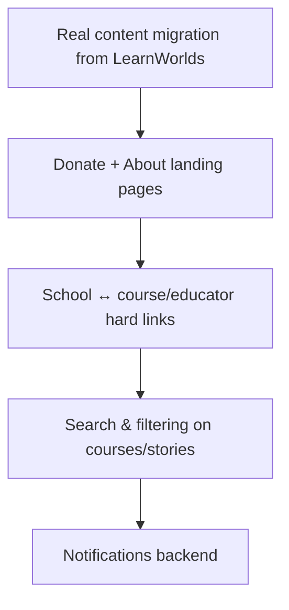

# Product Roadmap

> Digital Nalanda LMS — what's built and what's next.

## Shipped

- **Foundation** — Next.js + TS + Tailwind frontend, Django + DRF + PostgreSQL
  backend, monorepo, Docker optional.
- **Courses** — categories, courses, modules, lessons; public APIs; YouTube lessons.
- **Auth & profile** — JWT (email login), full student profile.
- **Enrollments & progress** — enroll, lesson completion, auto progress + completion.
- **Certificates** — auto-issued PDF with QR, public verification, admin revoke.
- **Live classes & events** — manual Zoom links, recordings, attendance, homepage feeds.
- **Homepage data platform** — Schools, Learning Paths, Educators, Community
  Libraries, Impact Metrics, Newsletter — DB-driven + admin-managed.
- **Stories platform** — stories with categories/media, `/stories` pages, SEO.
- **Schools platform** — `/schools` + rich school pages aggregating related content.
- **Navigation** — ecosystem nav (dropdowns, mobile drawer, bottom bar, profile menu).
- **Migration System V1** — idempotent CSV import commands + guide.
- **Admin Dashboard V2** — metrics + newsletter export, role-gated; Django admin for CRUD.
- **Docs** — ERD, permissions, API reference, deployment, migration plans.
- **Teacher / course-creator approval** — applications, admin review, course workflow, audit log.
- **Visual course builder** — tabbed studio (Basic/Curriculum/Preview/Submit), chapter+lesson tree with reorder/move/duplicate, autosave, stats, validated submit.
- **Block-based lesson builder** — Notion-style content blocks (text/media/quiz) stored as JSON, add/reorder/inline-edit, device preview (desktop/tablet/mobile), rendered on the student page.
- **Live-class calendar** — ICS download + Google/Outlook add-to-calendar; live_class lesson type.
- **AI assistant** — Gemini-backed course/lesson summary generator (env key, template fallback, suggestion-only, never auto-publishes).
- **Nalanda chatbot** — rule-based + AI fallback, history, floating widget + /chatbot.
- **Counselling** — academic guidance requests, student-private, mentor/admin reply queue.
- **Notifications & announcements** — in-app notifications (bell + center + triggers) and audience-targeted announcement banner.
- **Assignments & submissions** — teacher create, student submit, mentor/teacher grading + feedback, graded notifications.
- **Course versioning** — every publish snapshotted; working-draft-vs-published diff, compare any two versions, rollback (id-preserving so progress survives), auto-checkpoint before restore, admin diff review.

## Next (near-term)

- Import real Digital Nalanda content (CSV → staging → prod).
- `/donate` + `/about` pages; wire donation flow (no payments yet).
- Hard-link schools to their courses/educators (FKs) for precise aggregation.
- Course/story search + richer filtering.
- Notifications backend (UI placeholder already exists).

## Later

- **Payments** (donations + any paid offerings).
- **Zoom API** integration (auto join links, attendance, recordings).
- **Flutter mobile app**.
- **Learning paths as real sequences** (ordered course lists + path progress).
- **Advanced blocks** (columns, tabs, accordion, gallery, audio, poll, discussion).
- **Quizzes & assessments**; **alumni network**; **multi-language UI**.

## Explicitly deferred (per current direction)

Flutter app, Zoom API, payments, real-data scraping — not started yet by design.
